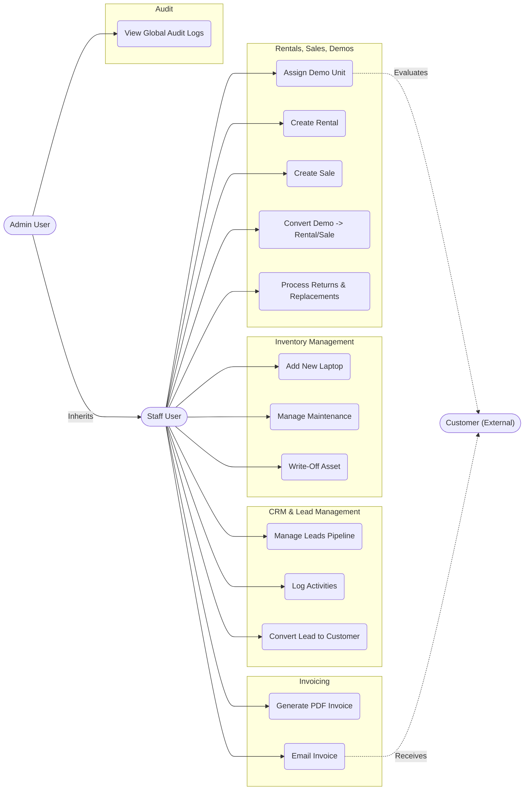

# Requirements & Use Case Diagrams
**Ditel Network Solutions Inventory System**

## 1. Functional Requirements

### 1.1 Inventory Management
- **FR1.1**: The system must track laptops with comprehensive attributes including asset tag, serial number, brand, model, processor, RAM, storage, GPU, and status.
- **FR1.2**: Laptops must follow a strict "never-delete" policy. They may only be moved into terminal statuses such as `RETURNED_TO_SUPPLIER` or `WRITTEN_OFF`.
- **FR1.3**: The system must log every state change to an immutable `LaptopHistory` ledger.
- **FR1.4**: The system must track physical stock movements via a `StockMovement` table.
- **FR1.5**: The system must allow staff to record maintenance events (Send to Maintenance, Return from Maintenance).

### 1.2 Customer Management
- **FR2.1**: The system must support both Individual and Company profiles.
- **FR2.2**: The system must securely store tax and identity markers (GST, PAN, Aadhar, CIN).
- **FR2.3**: The system must automatically maintain an immutable `CustomerHistory` log tracking all major interactions (Rentals, Demos, Sales).

### 1.3 Rentals & Sales
- **FR3.1**: The system must allow staff to issue a Rental to a Customer with expected return dates.
- **FR3.2**: The system must snapshot laptop attributes (specs, price) inside the `RentalItem` and `SaleItem` tables at the exact time of transaction.
- **FR3.3**: The system must support returning specific laptops from a rental or sale, generating new parent/child linkages for tracking.
- **FR3.4**: The system must support replacing a faulty rented/sold laptop with a new one in a single atomic transaction.

### 1.4 Demos
- **FR4.1**: The system must allow staff to issue evaluation Demo laptops to customers for a specified duration.
- **FR4.2**: The system must allow staff to directly convert a Demo into a finalized Rental or Sale without recreating the core customer or item data.
- **FR4.3**: The system must capture structured feedback and ratings upon Demo return.

### 1.5 Invoicing & Billing
- **FR5.1**: The system must generate PDF invoices for Sales, Rentals, or Custom charges.
- **FR5.2**: The system must support emailing the PDF invoice directly to the customer.
- **FR5.3**: The system must track invoice payment statuses (`UNPAID`, `PARTIAL`, `PAID`, `CANCELLED`).

### 1.6 CRM (Customer Relationship Management)
- **FR6.1**: The system must track prospective Leads through a defined pipeline (`NEW` → `CONTACTED` → `NEGOTIATION` → `CONVERTED` or `LOST`).
- **FR6.2**: The system must allow leads to be seamlessly converted into actual Customers.
- **FR6.3**: The system must allow staff to log communications (`Activity`) and schedule future `FollowUps`.

### 1.7 Audit & Security
- **FR7.1**: The system must maintain a global `AuditLog` capturing who changed what and when, storing JSON diffs of `old_data` and `new_data`.
- **FR7.2**: The system must authenticate users via JSON Web Tokens (JWT).
- **FR7.3**: Access must be strictly restricted to authenticated Staff and Admin users.

## 2. Non-Functional Requirements
- **Performance**: API responses must return in under 300ms for standard queries.
- **Data Integrity**: Database transactions must be strictly atomic to prevent orphaned inventory or ghost stock movements.
- **Availability**: The system must support concurrent reads and writes from multiple staff members simultaneously.
- **Scalability**: Historical ledgers (AuditLogs, LaptopHistory) must be optimized for append-only scaling.

---

## 3. Use Case Diagram

## 4. Actor Descriptions
1. **Staff User**: Regular employee handling daily operations. They manage leads, inventory, rentals, sales, and generate invoices.
2. **Admin User**: Elevated privileges. Can view global immutable audit logs, user management, and system settings.
3. **Customer**: An external entity. They do not log into the system, but their data and interactions drive the workflows. They receive invoices via email.

## 5. Primary Use Case Descriptions

### UC_ConvertLead (Convert Lead to Customer)
- **Actor**: Staff
- **Trigger**: A lead agrees to do business (Rent/Buy).
- **Precondition**: Lead is in `NEGOTIATION` or `CONTACTED` status.
- **Flow**: Staff clicks "Convert". System automatically spawns a `Customer` record mapping company/individual details. Lead status becomes `CONVERTED` and is permanently linked to the new Customer.

### UC_Rental (Create Rental)
- **Actor**: Staff
- **Trigger**: Customer needs to rent laptops.
- **Flow**: Staff selects an existing Customer, sets expected return date, and selects one or more `AVAILABLE` laptops. System generates the `Rental`, creates `RentalItems` containing hard snapshots of current specs, moves laptops to `RENTED` status, and logs a `StockMovement (OUT)`.

### UC_Return (Process Returns)
- **Actor**: Staff
- **Trigger**: Customer returns laptops.
- **Flow**: Staff selects laptops to return. System creates a *child* Rental record with status `RETURNED`. Laptops are moved from `RENTED` to `AVAILABLE`. `StockMovement (RETURN)` is generated.

### UC_ConvertDemo (Convert Demo to Rental/Sale)
- **Actor**: Staff
- **Trigger**: Customer finishes Demo evaluation and wishes to keep the units permanently.
- **Flow**: Staff clicks Convert. System atomically creates a Rental or Sale record, updates the Demo to `CONVERTED_RENTAL`/`CONVERTED_SALE`, updates laptop statuses from `DEMO` to `RENTED`/`SOLD`, and logs stock movements.

### UC_Invoice (Generate PDF Invoice)
- **Actor**: Staff
- **Trigger**: End of billing cycle or point of sale.
- **Flow**: System compiles `Invoice` and `InvoiceItems`. System uses `weasyprint` or `xhtml2pdf` to compile HTML into a branded PDF document representing the charge. Status defaults to `UNPAID`.
