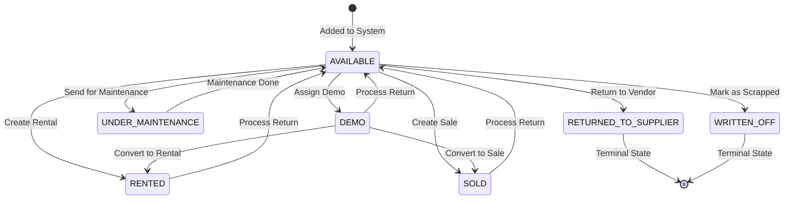
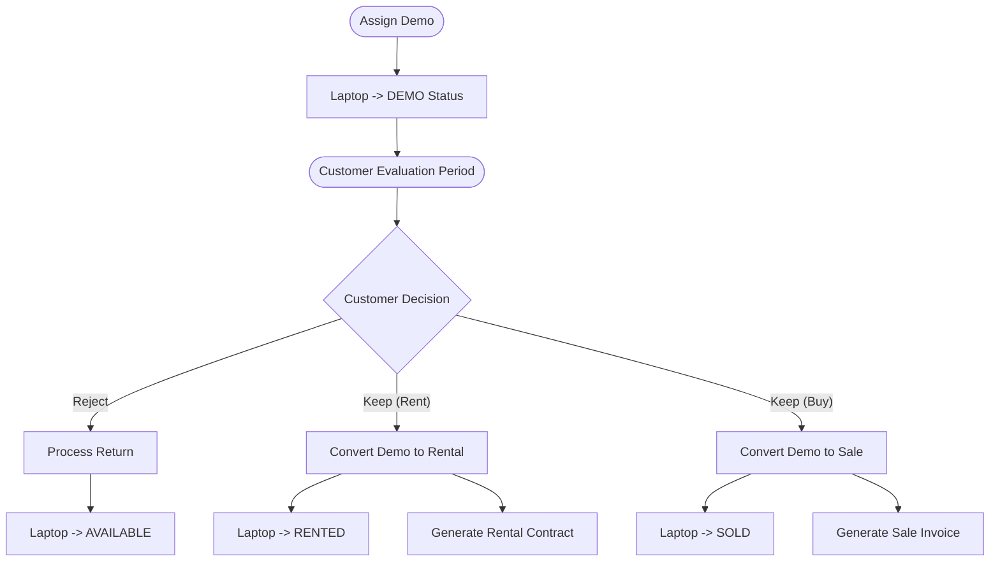
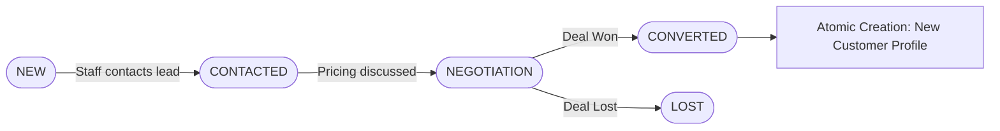
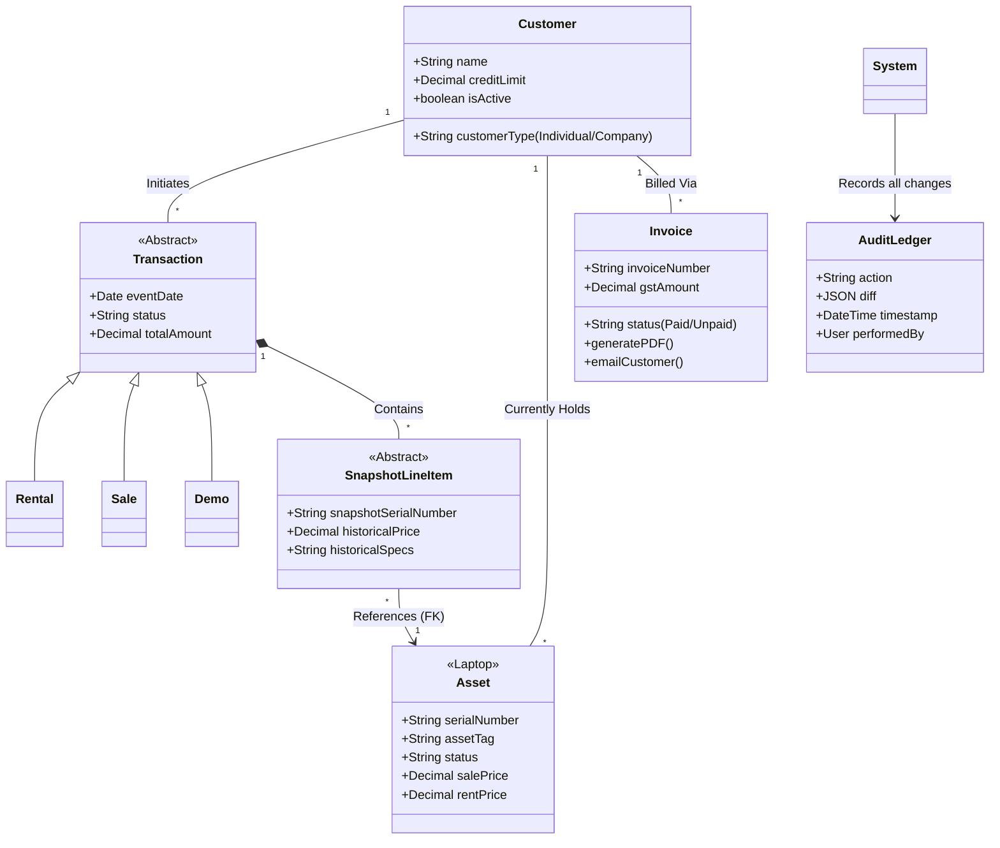

# Business Workflows & Domain Model
**Ditel Network Solutions Inventory System**

## 1. Laptop Lifecycle State Machine

Because laptops are the core physical asset and are subject to strict accounting rules, they undergo a rigorous lifecycle rather than simply being deleted from the database.



## 2. Business Workflows

### 2.1 The Rental & Return Workflow

```mermaid
flowchart TD
    Start([Customer Requests Rental]) --> Check[Check Available Inventory]
    Check --> CreateRental[Create Rental Record]
    CreateRental --> Snapshot[Snapshot Laptop Specs into RentalItem]
    Snapshot --> UpdateStatus[Update Laptop Status: AVAILABLE -> RENTED]
    UpdateStatus --> StockMove[Log StockMovement: OUT]
    StockMove --> EndOut([Laptops with Customer])
    
    EndOut --> ReturnReq([Customer Returns Laptops])
    ReturnReq --> NewChildRental[Create Child Rental Record (Status: RETURNED)]
    NewChildRental --> RestoreStatus[Update Laptop Status: RENTED -> AVAILABLE]
    RestoreStatus --> StockMoveIn[Log StockMovement: RETURN]
    StockMoveIn --> End([Laptops back in Stock])
```

### 2.2 The Demo Conversion Workflow



### 2.3 CRM Lead Pipeline Workflow



## 3. Domain Model

The Domain Model abstracts the relational tables into core business concepts.



## 4. Core Business Rules

1. **Denormalized Historical Accuracy**: A `RentalItem`, `SaleItem`, or `DemoItem` must copy the laptop's brand, model, serial, specs, and price fields directly into its own table row upon creation. If a laptop is later upgraded (e.g., RAM added) and the base model is updated, the historical rental contract MUST reflect the original specs and price.
2. **Immutable Ledgers**: Rows in `StockMovement`, `LaptopHistory`, `CustomerHistory`, and `AuditLog` can only be INSERTED. They cannot be UPDATED or DELETED by the application logic.
3. **Terminal States**: `WRITTEN_OFF` and `RETURNED_TO_SUPPLIER` are absolute terminal states. Laptops in these states cannot be rented, sold, or modified.
4. **Child-Chain Replacements**: When a laptop is swapped out (replaced) during a rental, a new `Rental` record is created with a foreign key (`parent_rental`) pointing to the original contract, rather than mutating the original contract. This preserves the billing dates and timeline of physical possession.
