# Entity Relationship Diagram

## Overview
This document illustrates the complete Entity-Relationship schema for the Ditel Network Solutions Inventory System. It details all Django models, their attributes, and relationships.

## ER Diagram

```mermaid
erDiagram
    %% Auth
    User {
        int id PK
        string username
        string email
    }

    %% Common
    AuditLog {
        int id PK
        int user_id_snapshot
        string username_snapshot
        string module
        string action
        string record_id
        string old_data "JSON"
        string new_data "JSON"
        string changed_fields "JSON"
        string ip_address
        datetime timestamp
    }

    %% Inventory
    Supplier {
        int id PK
        string name
        string phone
        string email
        string address
        string gst_number
    }
    
    Laptop {
        int id PK
        string asset_tag
        string serial_number
        string brand
        string model
        string processor
        string ram
        string storage
        string gpu
        string display_size
        string os
        string condition
        decimal purchase_price
        decimal price
        decimal rent_per_month
        string status "AVAILABLE/RENTED/SOLD/DEMO/..."
        int supplier_id FK
        int customer_id FK "Current holder"
    }
    
    LaptopHistory {
        int id PK
        string action
        string from_status
        string to_status
        string remarks
        int laptop_id FK
        int customer_id FK
    }
    
    StockMovement {
        int id PK
        string movement_type "IN/OUT/RETURN/SOLD/..."
        int quantity
        string remarks
        int laptop_id FK
    }

    %% Customers
    Customer {
        int id PK
        string name
        string customer_type "individual/company"
        string phone
        string email
        string company_name
        string gst_number
        string pan_number
        decimal credit_limit
        boolean is_active
    }
    
    CustomerHistory {
        int id PK
        string action
        string laptop_name
        string serial
        decimal amount
        date event_date
        int customer_id FK
    }

    %% Rentals
    Rental {
        int id PK
        string status "ONGOING/RETURNED/REPLACED"
        date rent_date
        date expected_return_date
        date actual_return_date
        decimal total_amount
        int customer_id FK
        int parent_rental_id FK
    }
    
    RentalItem {
        int id PK
        decimal rent_price
        string snapshot_serial_number
        string snapshot_customer_name
        int rental_id FK
        int laptop_id FK
    }

    %% Sales
    Sale {
        int id PK
        string status "COMPLETED/RETURNED"
        date sale_date
        decimal total_amount
        int customer_id FK
    }
    
    SaleItem {
        int id PK
        decimal sale_price
        string snapshot_serial_number
        int sale_id FK
        int laptop_id FK
    }

    %% Demo
    Demo {
        int id PK
        string status "ONGOING/RETURNED/CONVERTED_..."
        date assigned_date
        string purpose
        string feedback
        int feedback_rating
        int customer_id FK
        int converted_rental_id FK
        int converted_sale_id FK
    }
    
    DemoItem {
        int id PK
        string snapshot_serial_number
        int demo_id FK
        int laptop_id FK
    }

    %% Invoices
    Invoice {
        int id PK
        string invoice_number
        string invoice_type "SALE/RENTAL/CUSTOM"
        string status "UNPAID/PAID/PARTIAL/CANCELLED"
        decimal total_amount
        int customer_id FK
    }
    
    InvoiceItem {
        int id PK
        string description
        int quantity
        decimal price
        decimal total
        int invoice_id FK
        int laptop_id FK
    }

    %% CRM
    Lead {
        int id PK
        string name
        string phone
        string source
        string intent "RENT/BUY/BOTH"
        string status "NEW/CONTACTED/CONVERTED/LOST"
        int converted_customer_id FK
    }
    
    Activity {
        int id PK
        string activity_type "CALL/EMAIL/VISIT/..."
        string summary
        datetime activity_date
        int lead_id FK
        int customer_id FK
    }
    
    FollowUp {
        int id PK
        string status "PENDING/DONE/CANCELLED"
        datetime scheduled_at
        int lead_id FK
        int customer_id FK
    }
    
    Tag {
        int id PK
        string name
        string color
    }
    
    LeadTag {
        int id PK
        int lead_id FK
        int tag_id FK
    }
    
    CustomerTag {
        int id PK
        int customer_id FK
        int tag_id FK
    }
    
    %% Relationships
    
    Supplier ||--o{ Laptop : "supplies"
    Laptop ||--o{ LaptopHistory : "has history"
    Laptop ||--o{ StockMovement : "has movements"
    
    Customer ||--o{ CustomerHistory : "has history"
    Customer ||--o{ Laptop : "currently holds"
    Customer ||--o{ Rental : "rents"
    Customer ||--o{ Sale : "buys"
    Customer ||--o{ Demo : "evaluates"
    Customer ||--o{ Invoice : "billed in"
    
    Rental ||--o{ Rental : "parent of"
    Rental ||--o{ RentalItem : "contains"
    Laptop ||--o{ RentalItem : "rented in"
    
    Sale ||--o{ SaleItem : "contains"
    Laptop ||--o{ SaleItem : "sold in"
    
    Demo ||--o{ DemoItem : "contains"
    Laptop ||--o{ DemoItem : "demoed in"
    Demo |o--o| Rental : "converts to"
    Demo |o--o| Sale : "converts to"
    
    Invoice ||--o{ InvoiceItem : "contains"
    Laptop ||--o{ InvoiceItem : "billed for"
    
    Lead |o--o| Customer : "converts to"
    Lead ||--o{ Activity : "has"
    Customer ||--o{ Activity : "has"
    Lead ||--o{ FollowUp : "has"
    Customer ||--o{ FollowUp : "has"
    Lead ||--o{ LeadTag : "tagged with"
    Tag ||--o{ LeadTag : "tags"
    Customer ||--o{ CustomerTag : "tagged with"
    Tag ||--o{ CustomerTag : "tags"

```

## Entity Descriptions

| Module | Entity | Purpose | Key Relationships |
|---|---|---|---|
| **Inventory** | `Laptop` | Core asset of the business. Tracks specs, purchase info, pricing, and current status. Uses a "never-delete" philosophy. | Belongs to `Supplier`, Currently held by `Customer` (nullable). Referenced by Items in Rentals, Sales, Demos. |
| **Inventory** | `Supplier` | Vendors who supply the laptops. | 1:M with `Laptop` |
| **Inventory** | `LaptopHistory` | Immutable append-only log of every status change on a laptop. | FK to `Laptop` and `Customer` |
| **Inventory** | `StockMovement` | Ledger of physical IN/OUT movements for laptops. Drives inventory counting. | FK to `Laptop` |
| **Customers** | `Customer` | The primary business actor (individuals or companies). | 1:M with Rentals, Sales, Demos, Invoices, and Laptops (current possession). |
| **Customers** | `CustomerHistory` | Immutable audit trail for customer events. Written automatically via signals. | FK to `Customer` |
| **Rentals** | `Rental` | Grouping of rented laptops for a specific period. Supports a parent/child chain for returns and replacements. | FK to `Customer`, Self-referential `parent_rental`. |
| **Rentals** | `RentalItem` | Snapshot table containing one row per rented laptop. Snapshots specs at time of rental. | FK to `Rental` and `Laptop` |
| **Sales** | `Sale` | Grouping of sold laptops. | FK to `Customer` |
| **Sales** | `SaleItem` | Snapshot table for sold laptops. | FK to `Sale` and `Laptop` |
| **Demo** | `Demo` | Evaluation unit assignment. Can be converted to Rental or Sale. | FK to `Customer`. 1:1 to `Rental` or `Sale` (on conversion). |
| **Demo** | `DemoItem` | Snapshot table for demo laptops. | FK to `Demo` and `Laptop` |
| **Invoices** | `Invoice` | Billing and financial document. Can generate PDFs. | FK to `Customer` |
| **Invoices** | `InvoiceItem` | Line items on the invoice. | FK to `Invoice` and `Laptop` (nullable) |
| **CRM** | `Lead` | A potential customer pipeline object. | 1:1 to `Customer` (upon conversion) |
| **CRM** | `Activity` | Logged communications (calls, emails, visits). | FK to `Lead` or `Customer` |
| **CRM** | `FollowUp` | Scheduled reminders for future contact. | FK to `Lead` or `Customer` |
| **CRM** | `Tag` & `*Tag` | Reusable labels with colors. Associated via M2M-style join tables (`LeadTag`, `CustomerTag`). | - |
| **Audit** | `AuditLog` | System-wide immutable ledger capturing who did what, when, including old/new JSON snapshots. | FK to `User` |

## Relationship Summary

- **The Laptop Lifecycle:** Laptops are the central hub. They are sourced from a `Supplier` and assigned to a `Customer`. A laptop's presence in a transaction is captured via an intermediary line-item table (`RentalItem`, `SaleItem`, `DemoItem`, `InvoiceItem`) which takes a **hard snapshot** of the laptop's specs and pricing at that exact moment.
- **Customer as the Actor:** Every major transaction (`Rental`, `Sale`, `Demo`, `Invoice`) is directly tied to a `Customer`. The customer acts as the unifying pivot point for the business workflows.
- **Conversion Pipelines:** `Lead` entities are converted directly into `Customer` entities via a OneToOne relationship. Similarly, `Demo` entities act as trials that can be directly converted into `Rental` or `Sale` entities, maintaining a OneToOne link to their outcome.
- **Audit & History:** The system heavily utilizes append-only history tables (`LaptopHistory`, `CustomerHistory`, `StockMovement`) to provide robust event sourcing. Furthermore, every model inheriting from `AuditModel` automatically tracks `created_by` and `updated_by` via the User model, while the global `AuditLog` captures JSON diffs for every state change.
