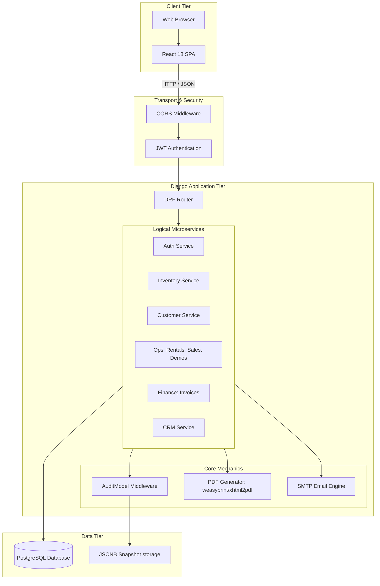
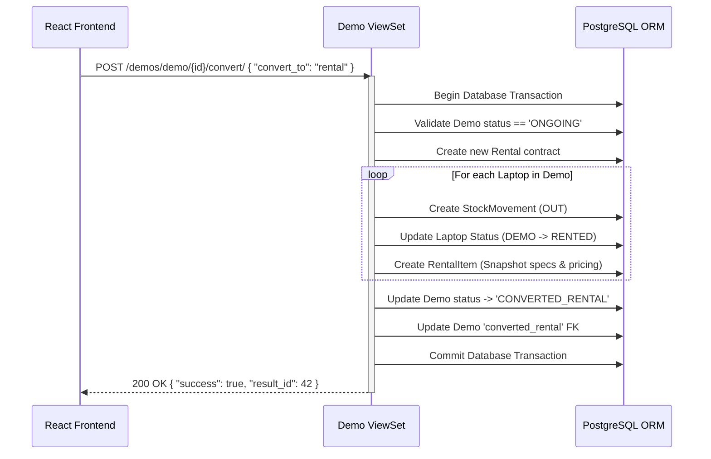
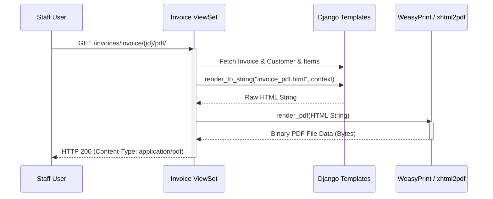

# System Architecture & API Details

## 1. System Architecture Overview

The system is decoupled into a frontend Single Page Application (SPA) and a backend REST API. 
The backend utilizes Django 5.2 and Django REST Framework, while the frontend is constructed with React 18, Vite, and Radix UI primitives. Authentication bridges the two via short-lived JWT Access Tokens and HttpOnly Refresh Tokens.

## 2. System Architecture Diagram

## 3. Technology Stack

| Layer | Technology | Details |
|---|---|---|
| **Frontend Framework** | React 18, TypeScript, Vite 6 | Fast HMR, strongly typed UI layer. |
| **Frontend Styling** | Tailwind CSS, Radix UI | Accessible headless primitives wrapped in Tailwind utility classes. |
| **Backend Framework** | Django 5.2, DRF | Robust Python MVC, extensive ORM. |
| **Database** | PostgreSQL | Relational data integrity, supports complex JSON queries (used in Audit Logs). |
| **Authentication** | SimpleJWT | Stateless authentication mechanism. |
| **Document Generation** | WeasyPrint / xhtml2pdf | HTML to PDF rendering for Invoices. |
| **Charts / Analytics** | Recharts (Frontend) | Renders dashboard data natively in SVG. |

## 4. API Endpoints Reference

| Method | Endpoint | Description | Auth Required |
|---|---|---|---|
| **POST** | `/auth/token/` | Obtain JWT Access & Refresh tokens. | No |
| **POST** | `/auth/token/refresh/` | Renew Access token. | No |
| **GET** / **POST** | `/inventory/laptops/` | List, search, and create laptops. | Yes (Staff) |
| **POST** | `/inventory/laptops/{id}/return-to-supplier/` | Change status to returned to vendor. | Yes |
| **POST** | `/inventory/laptops/{id}/send-maintenance/` | Move stock out for repair. | Yes |
| **GET** | `/inventory/laptops/stats/` | Dashboard inventory metrics. | Yes |
| **GET** / **POST** | `/customers/customers/` | Manage individual/corporate profiles. | Yes |
| **POST** | `/rentals/rental/{id}/return_laptops/` | Partially or fully return rented items. | Yes |
| **POST** | `/rentals/rental/{id}/replace_laptop/` | Swap faulty equipment atomic transaction. | Yes |
| **POST** | `/demos/demo/{id}/convert/` | Convert demo eval into rental or sale. | Yes |
| **POST** | `/invoices/invoice/{id}/send-email/` | Deliver PDF payload to customer inbox. | Yes |
| **GET** | `/invoices/invoice/{id}/pdf/` | Direct download of Invoice PDF. | Yes |
| **POST** | `/crm/leads/{id}/convert/` | Spawn customer entity from lead pipeline. | Yes |

## 5. Sequence Diagrams

### 5.1 Demo Conversion to Rental Flow

This is one of the most complex transactional flows, updating multiple statuses and generating snapshots concurrently.

### 5.2 PDF Invoice Generation Flow

## 6. Microservices Logical Decomposition

While physically deployed as a monolithic Django application, the system is strictly decoupled into Logical Microservices via Django Apps.

- `inventory/` manages the physical truth.
- `rentals/`, `sales/`, and `demo/` encapsulate transaction logic but rely entirely on `inventory/` signals to update asset states.
- `audit/` acts as a cross-cutting concern (AOP style), utilizing middleware and class mixins to intercept HTTP requests and DB saves across all other services without tight coupling.
